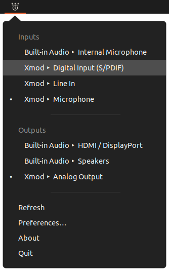

Sound Switcher Indicator
========================

Sound input/output selector indicator for Ubuntu/Unity. I created this app because there was just no sound switcher indicator available.

It shows an icon in the indicator area in Ubuntu's Panel. The icon's menu allows you to switch the current sound input and output (i.e. *source ports* and *sink ports* in PulseAudio's terms, respectively) with just two clicks:



The application makes use of the native PulseAudio API (version 4.0 or newer is required).


Installation
------------

Please refer to the [INSTALL](INSTALL) document.

For details see http://yktoo.com/software/indicator-sound-switcher


Bug Reporting
-------------

Run the application in verbose mode to see the detailed log:

    indicator-sound-switcher -vv

and, once the error condition has been reproduced, attach the output to the report.


Configuration
-------------

The indicator can be configured by using a [JSON](https://en.wikipedia.org/wiki/JSON) configuration file, whose default location is `~/.config/indicator-sound-switcher.json`.

If this file is present, the following items can be configured:

| Name                    | Type    | Default | Description                                                                   |
|-------------------------|---------|---------|-------------------------------------------------------------------------------|
| `show_inputs`           | boolean | true    | Whether to show the "Inputs" section (and all the input ports) in the menu.   |
| `show_outputs`          | boolean | true    | Whether to show the "Outputs" section (and all the output ports) in the menu. |
| `devices`               | object  |         | Provides configuration items for a specific device.                           |
| `devices`/(name)/`name` | string  |         | Allows to use a different display name for the device.                        |
| `devices`/(name)/`ports`| object  |         | Provides configuration items for the device's ports.                          |

The `devices` object contains configuration objects for each device. The name to be used is the PulseAudio's card name, which can be seen in the debug output of `indicator-sound-switcher -vv`. In the below example it's `alsa_card.pci-0000_00_08.0`:

    DEB   + Card[0] added: `alsa_card.pci-0000_00_08.0`

The `ports` object of the device configuration allows to further configure a specific device port in the menu. Likewise, the port's name can be found in the debug output, for example:

    DEB     + Card port added: `analog-output-speaker` (`Speakers`); priority: 10000; direction: 1; available: No

Here `analog-output-speaker` is the port name and `Speakers` is what will be displayed in the menu by default.

The configuration of the port is an object providing the following elements (all are optional):

| Name                    | Type    | Default | Description                                                                                                 |
|-------------------------|---------|---------|-------------------------------------------------------------------------------------------------------------|
| `visible`               | boolean | true    | Whether the corresponding menu item is visible.                                                             |
| `name`                  | string  |         | Alternative display name for the port (menu item text).                                                     |
| `preferred_profile`     | string  |         | Profile name to switch to by default when the menu item is selected. If not given, and the currently selected profile doesn't support this port, a profile with the maximum priority will be picked. |
| `always_available`      | boolean | false   | If `true`, the corresponding menu item will be displayed disregarding whether or not the port is available. |

Here's a sample configuration file:

```JSON
{
    "show_inputs": false,
    "show_outputs": true,
    "devices": {
        "alsa_card.pci-0000_00_06.0": {
            "name": "My lovely card",
            "ports": {
                "analog-output-speaker": "Boombox",
                "iec958-stereo-output": false,
                "analog-input-microphone": {
                    "name": "Mike",
                    "preferred_profile": "output:analog-stereo+input:analog-stereo",
                    "always_available": true
                }
            }
        },
        "alsa_card.pci-0000_01_00.1": {
            "name": "HDMI Audio"
        },
        "virtual": {
            "sinks": {
                "combined": "All at once",
                "WTF NETWORK?": {
                    "name": "Kithen computer"
                }
            }
        }
    }
}
```

It says that:

* The `Inputs` section will be hidden.
* The device `alsa_card.pci-0000_00_06.0` will be referred to as `My lovely card`, and
  * Its speaker output will be called `Boombox`,
  * Its S/PDIF port will be hidden from the menu,
  * Its microphone input will be called `Mike`, activate the duplex (input+output) profile when selected, and be shown even when isn't available.
* The device `alsa_card.pci-0000_01_00.1` will be named `HDMI Audio` in the menu items.
* For the rest all the defaults will apply.

Changelog
---------

See [changelog](debian/changelog).
